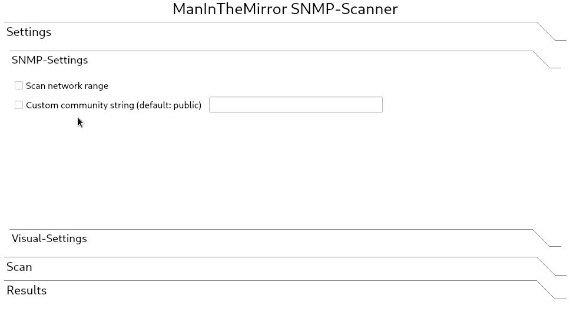
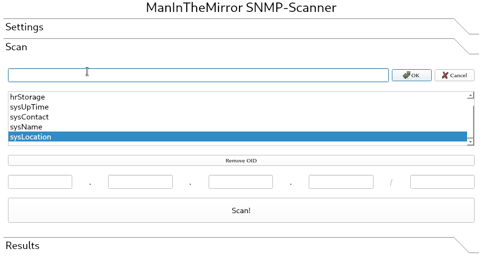
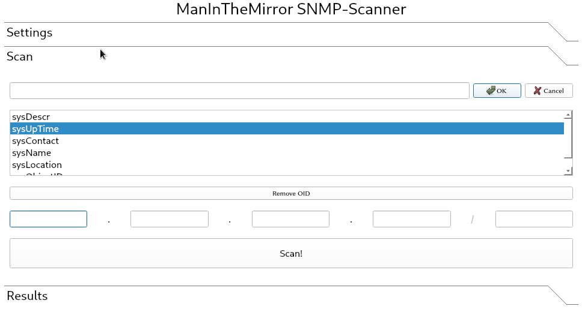

1. [Introduction](#introduction)

2. [Setup](#setup)
    * [Prerequisites](#prerequisites)
    * [Execution](#execution)
    * [Default settings](#default-settings)

3. [Features & Roadmap](#features--roadmap)
    * [Current features](#current-features)
    * [Planned](#planned)
    * [UI](#ui)
        * [SNMP-Settings](#snmp-settings)
        * [Visual-Settings](#visual-settings)
        * [Scan single host](#scan-single-host)
        * [Scan network range](#scan-network-range)
        * [Results](#results)

# Introduction

ManInTheMirror is an **SNMP network scanning tool** written in **C++** using the [**Net-SNMP
library**](http://www.net-snmp.org). 
The UI is created using [**Qt5**](https://www.qt.io).

# Setup

## Prerequisites

- `net-snmp`
    - Installation on Arch Linux: `pacman -S net-snmp`
- `qt5-base`
    - Installation on Arch Linux: `pacman -S qt5-base`

## Execution

To execute the program run the binary that is packaged in the latest release or build the project yourself. 

## Default settings

- Default community string is `public`
- Requests are sent using `GETNEXT`, so watch out when inputting OIDs

# Features & Roadmap

## Current features

- **Scan single IP** with multiple OIDs
- **Scan network range** with multiple OIDs
- Some **default OIDs are already loaded** into the UI
- **Change community string** in the UI
- All scanning is done in an **asynchronous** manner

## Planned

- **Trap listener**
- **Rework UI**

## UI

### SNMP-Settings

### Visual-Settings

### Scan single host

### Scan network range

### Results

