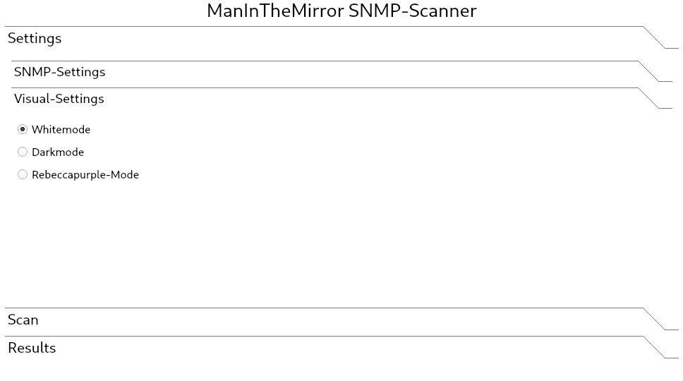
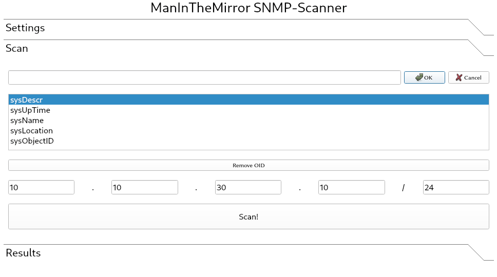
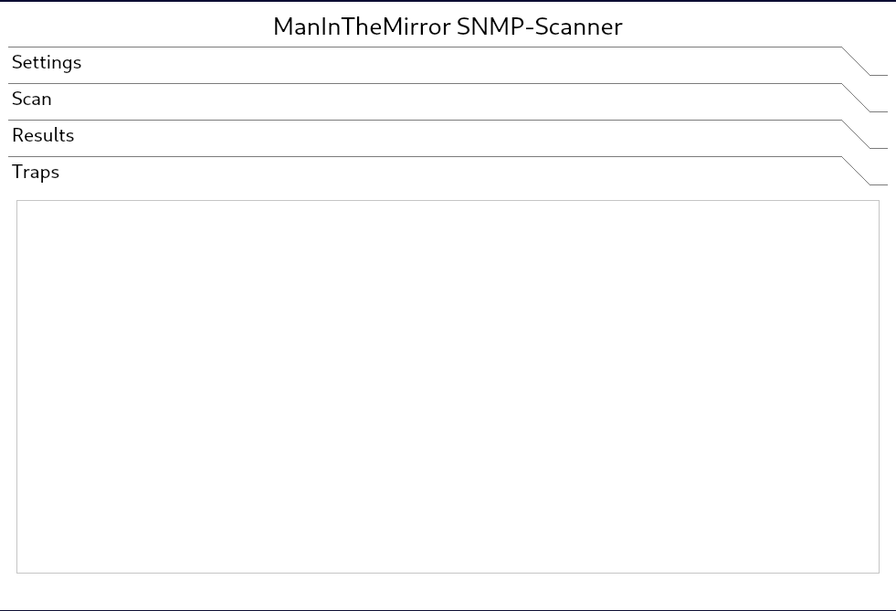

1. [Introduction](#introduction)

2. [Setup](#setup)
    * [Prerequisites](#prerequisites)
    * [Execution](#execution)
    * [Default settings](#default-settings)
    * [Load custom MIBs](#load-custom-mibs)

3. [Features & Roadmap](#features--roadmap)
    * [Current features](#current-features)
    * [Planned](#planned)
    * [UI](#ui)
        * [SNMP-Settings](#snmp-settings)
        * [Visual-Settings](#visual-settings)
        * [Scan single host](#scan-single-host)
        * [Scan network range](#scan-network-range)
        * [Results](#results)
        * [Traps](#traps)

# Introduction

ManInTheMirror is an **SNMP network scanning tool** written in **C++** using the [**Net-SNMP
library**](http://www.net-snmp.org). MITM is also able to listen for incoming trap messages through sockets and decodes
the message using [**OpenSSL with asn1parse**](https://www.openssl.org). 
The UI is created using [**Qt5**](https://www.qt.io).

# Setup

## Prerequisites

- `net-snmp`
    - Installation on Arch Linux: `sudo pacman -S net-snmp`
- `qt5-base`
    - Installation on Arch Linux: `sudo pacman -S qt5-base`
- `tr`
    - Should **already be preinstalled** on Linux.
- `xxd`
    - Should **already be preinstalled** on Linux.
    - Installation on Arch Linux: `sudo pacman -S xxd`
- `openssl`
    - Should **already be preinstalled** on Linux.
    - Installation on Arch Linux: `sudo pacman -S openssl`

## Execution

To execute the program run the binary that is packaged in the latest release or build the project yourself. 

## Default settings

- Default community string is `public`
- Requests are sent using `GETNEXT`, so watch out when inputting OIDs
- Traps are received on **port 162**, therefore the program **must be run with sudo privileges**
- Trap messages that are received as **strings are printed normally as strings**. However trap messages that are received as, for example, **integers**, are **printed as hex numbers**.

## Load custom MIBs

The net-snmp installation comes with a default set of MIBs. Adding custom MIB files can be done by copying them to the respective MIB directory and then loading them. 
To find out the MIB directory path, execute following command:  
`net-snmp-config --default-mibdirs`  
For more information on how to add and load new MIBs, consult [**Net-SNMPs tutorial on how to load custom MIBs**](http://net-snmp.sourceforge.net/wiki/index.php/TUT:Using_and_loading_MIBS).

# Features & Roadmap

## Current features

- **Scan single IP** with multiple OIDs
- **Scan network range** with multiple OIDs
- Some **default OIDs are already loaded** into the UI
- **Change community string** in the UI
- All scanning is done in an **asynchronous** manner
- Receive and output **traps**
- Trap listener starts **listening on program startup**
- Fully resizable window

## Planned

- **Rework UI**

## UI

### SNMP-Settings

### Visual-Settings

### Scan single host

### Scan network range

### Results

### Traps

